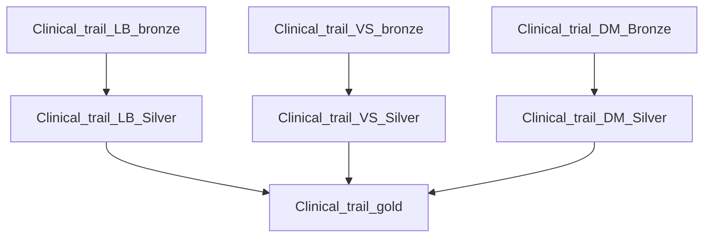
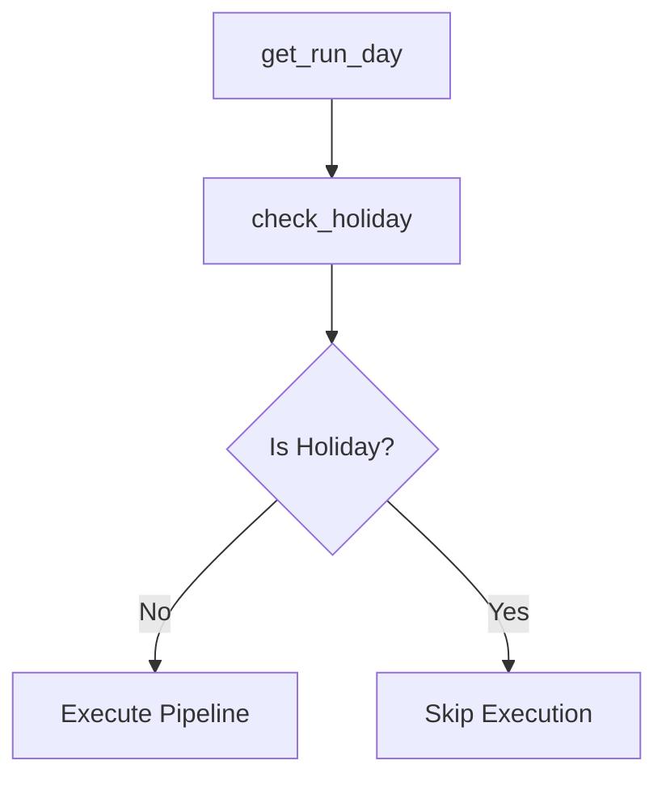

# Pfizer Pharma Data Pipeline Project

## 🏢 Project Overview

This project implements a comprehensive data pipeline for Pfizer pharmaceutical operations using **Databricks** and **Delta Lake** with a **Medallion Architecture**. The system processes clinical trials data, manufacturing information, and quality control results through bronze, silver, and gold layers for data refinement and analytics.

## 🏗️ Architecture Overview

### Medallion Architecture Implementation

The project follows the Lakehouse architecture pattern with three distinct layers:

```
┌─────────────────┐    ┌─────────────────┐    ┌─────────────────┐
│     BRONZE      │    │     SILVER      │    │      GOLD      │
│   Raw Data      │───▶│  Cleaned Data   │───▶│ Business Ready │
│   Ingestion     │    │   Validation    │    │   Analytics     │
└─────────────────┘    └─────────────────┘    └─────────────────┘
```


## 📁 Project Structure

```
Pharma_project/
├── 📁 pipeline/                 # Databricks job definitions
│   ├── Client_trail_pipeline.yml
│   ├── Lookup_Pipeline.yml
│   └── Manufacturing_Pipeline.yml
├── 📁 transform/               # Data transformation notebooks
│   ├── 📁 bronze/              # Raw data ingestion
│   ├── 📁 silver/              # Data cleaning & validation
│   └── 📁 gold/                # Business logic & aggregation
├── 📁 dataset/                 # Reference data
│   └── schedule_holidays.csv
├── 📁 images/                  # Documentation assets
│   ├── architecture.svg
│   ├── pipeline_img/
│   └── tables/
├── 📁 result/                  # Output visualizations
│   ├── df_analyst_vis.png
│   ├── newplot (1).png
│   └── visualization.png
├── 📁 Setup/                   # Environment setup
│   ├── setup_catalog.sql
│   └── utilities.py
└── 📁 testing/                 # Test scripts
```

## 🔄 Data Pipeline Components

### 1. Clinical Trials Pipeline

The main pipeline processes three types of clinical trial data:

#### **Laboratory Results (LB)**
- **Source**: Clinical trial laboratory measurements
- **Processing**: Bronze → Silver → Gold transformation
- **Output**: Validated lab results ready for analysis

#### **Vital Signs (VS)**
- **Source**: Patient vital signs monitoring
- **Processing**: Bronze → Silver → Gold transformation
- **Output**: Cleaned vital signs data

#### **Demographics (DM)**
- **Source**: Patient demographic information
- **Processing**: Bronze → Silver → Gold transformation
- **Output**: Standardized demographic data

### 2. Manufacturing Pipeline

Processes manufacturing and quality control data:

- **Equipment Lot Tracking**
- **Manufacturing Deviations**
- **Manufacturing Orders**
- **Quality Control Lab Results**

### 3. Holiday Lookup Pipeline

Conditional pipeline execution based on holidays:

```python
# Holiday Schedule Management
Date,Holiday Name
26-01-2024,Republic Day
08-03-2024,Maha Shivaratri
25-03-2024,Holi
... [Additional holidays]
```

## 🛠️ Technology Stack

- **Platform**: Databricks Lakehouse
- **Storage**: Delta Lake on S3
- **Processing**: Apache Spark
- **Architecture**: Medallion (Bronze-Silver-Gold)
- **Ingestion**: Auto Loader with CloudFiles
- **Scheduling**: Databricks Jobs

## 📊 Data Flow Architecture

### Bronze Layer (Raw Data Ingestion)
```python
# Example: Clinical Trials LB Processing
df_bronze = (
    spark.readStream
    .format("cloudFiles")
    .option("cloudFiles.format", "csv")
    .option("pathGlobFilter", "*.csv")
    .option("header","true")
    .option("cloudFiles.inferColumnTypes", "true")
    .load(base_path)
)
```

### Silver Layer (Data Cleaning & Validation)
- Schema validation
- Data quality checks
- Standardization
- Deduplication

### Gold Layer (Business Analytics)
- Aggregated metrics
- KPI calculations
- Reporting tables
- ML-ready datasets

## 📈 Visualizations & Results

### Analytics Dashboard Outputs

#### Clinical Trial Analysis


#### Data Analyst View


#### Statistical Analysis
.png)

## 🚀 Setup & Installation

### Prerequisites
- Databricks workspace
- S3 bucket for data storage
- Appropriate IAM permissions
- Databricks secrets configured

### Environment Setup

1. **Create Catalogs and Schemas**
```sql
-- Run setup_catalog.sql
CREATE CATALOG IF NOT EXISTS pfizer;
USE CATALOG pfizer;
CREATE SCHEMA IF NOT EXISTS pfizer.bronze;
CREATE SCHEMA IF NOT EXISTS pfizer.silver;
CREATE SCHEMA IF NOT EXISTS pfizer.gold;
```

2. **Configure Secrets**
```python
# Example secret configuration
base_path = dbutils.secrets.get("bucket","clinical_trails_LB")
```

3. **Deploy Pipelines**
- Import pipeline YAML files to Databricks Jobs
- Configure job schedules
- Set up dependencies

## 📋 Pipeline Execution

### Clinical Trials Pipeline Flow



### Holiday-Based Scheduling



## 🔧 Configuration

### Pipeline Settings
- **Performance Target**: PERFORMANCE_OPTIMIZED
- **Queue**: Enabled
- **Trigger**: AvailableNow for streaming
- **Checkpoint Location**: Configured for each stream

### Data Sources
- **Clinical Trials**: Laboratory, Vital Signs, Demographics
- **Manufacturing**: Equipment, Lots, Orders, QC Results
- **Reference**: Holiday schedules

## 📊 Key Features

### ✅ Data Quality
- Schema evolution support
- Automatic type inference
- Data validation rules
- Error handling and logging

### ✅ Scalability
- Auto-scaling Spark clusters
- Incremental processing
- Parallel task execution
- Optimized performance targets

### ✅ Monitoring
- Pipeline health checks
- Data quality metrics
- Execution logs
- Performance monitoring

## 🔍 Data Sources & Schemas

### Clinical Trials Data Types

1. **LB (Laboratory)**
   - Lab test results
   - Biomarker measurements
   - Clinical chemistry values

2. **VS (Vital Signs)**
   - Blood pressure
   - Heart rate
   - Temperature
   - Respiratory rate

3. **DM (Demographics)**
   - Patient information
   - Trial enrollment data
   - Site information

### Manufacturing Data Types

- Equipment tracking
- Lot manufacturing
- Quality control results
- Deviation tracking

## 📞 Support & Maintenance

### Monitoring Dashboard
Regular monitoring of:
- Pipeline execution status
- Data quality metrics
- Processing times
- Error rates

### Maintenance Tasks
- Schema updates
- Performance optimization
- Security audits
- Backup verification

## 📄 License

This project is proprietary to Pfizer and contains confidential pharmaceutical data processing pipelines.

## 🤝 Contributing

For contributions or issues, please contact the data engineering team at Pfizer.

---

**Last Updated**: May 2026  
**Version**: 1.0  
**Maintainer**: Pfizer Data Engineering Team