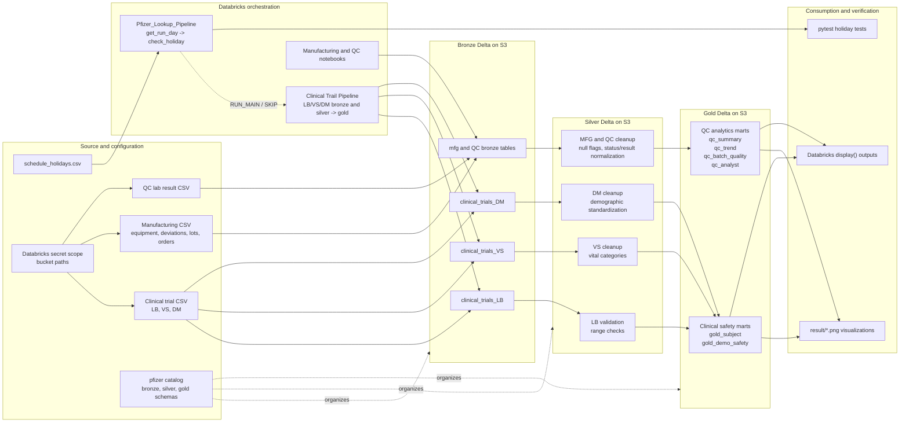

# Pfizer Pharma Project Architecture

This diagram summarizes the architecture implemented in this repository: Databricks Jobs run Spark notebooks, ingest CSV data from S3, and persist Delta Lake outputs through bronze, silver, and gold medallion layers.

## Implementation Mapping

- `pipeline/Client_trail_pipeline.yml` defines the clinical LB, VS, and DM notebook dependency chain.
- `pipeline/Lookup_Pipeline.yml` runs the date lookup flow before downstream scheduling decisions.
- `transform/bronze/` ingests raw CSV files using Auto Loader and writes Delta tables to S3.
- `transform/silver/` performs cleaning, standardization, null checks, validation flags, and Delta upserts or overwrites.
- `transform/gold/clinical_trails_gold.py` builds subject-level and demographic safety summaries.
- `transform/gold/QC_Lab_result_gold.py` builds QC summary, trend, batch-quality, and analyst-performance marts.
- `Setup/setup_catalog.sql` creates the `pfizer` catalog and medallion schemas.
- `result/` stores visualization outputs generated from the gold-layer analytics.
